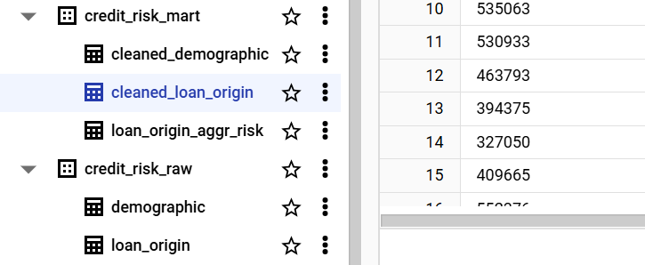
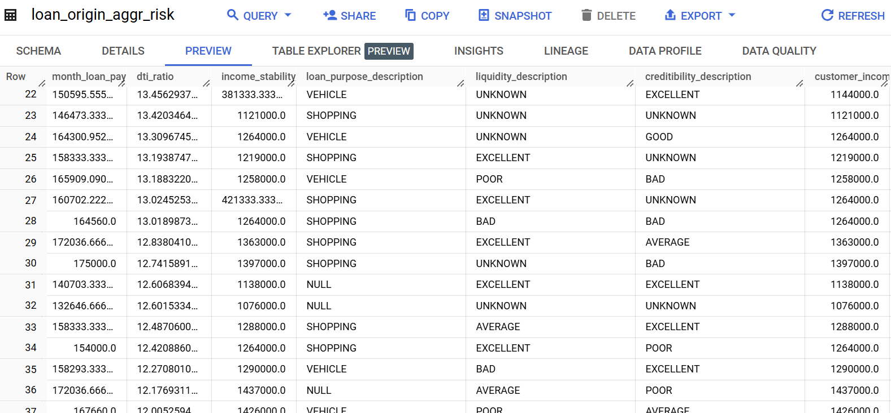

# Transformation RBAC SHBFinance Data

## Business Context

> [!IMPORTANT]
> SQL files are located in the `models/credit_risk_mart` directory.

The final data warehouse is layout in the `credit_risk_mart` schema like the following:

The `demographic` table is transformed from the original dataset into the `cleaned_demographic` table in the `credit_risk_mart` dataset. The `loan_origin` table is transformed into the `cleaned_loan_origin` table in the `credit_risk_mart` dataset.

> [!NOTE]
> You can refer to the transformation code at `./models/credit_risk_mart/cleaned_demographic.sql` and `./models/credit_risk_mart/cleaned_loan_origin.sql`.

The cleaning process includes:
- Handle `NULL` (missing) values: fill with `0`, `-1`, or `unknown` with `COALESCE`
- Handle data types: `CAST` to the correct data type that matches the data dictionary provided by **RBAC** host (e.g., `STRING`, `INTEGER`, `FLOAT`, `TIMESTAMP`)

After transformed, the `cleaned_demographic` table is joined with the `cleaned_loan_origin` table to create the `loan_origin_aggr_risk` table in the `credit_risk_mart` dataset.

The table is calculated some risk metrics such as:

- ✅ `dti_ratio` (Debt to Income Ratio)
- ✅ `income_stability_index` (Income Stability = Income / Number of Dependents + 1)
- ❌ `fpd30` (First Payment Default 30): not enough data context
- ❌ `fpd90` (First Payment Default 90): not enough data context
- ❌ `ar` (Approval Rate): not enough data context
- ❌ ... (other risk metrics): not enough data context

Example table aggr snapshot:

## Technical Context

Any technical details related to `dbt` has abstracted away from SQL scripts. You can refer to the `models` directory for the SQL scripts and see that I have not included any jinja templating or dbt-specific code in the SQL scripts to keep them clean and readable for non-technical users.

Other `dbt` configurations such as `seeds`, `sources`, `snapshots`, `tests`, and `docs` are also abstracted away from the SQL scripts. You can refer to the `dbt_project.yml` file for the configurations.
